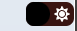
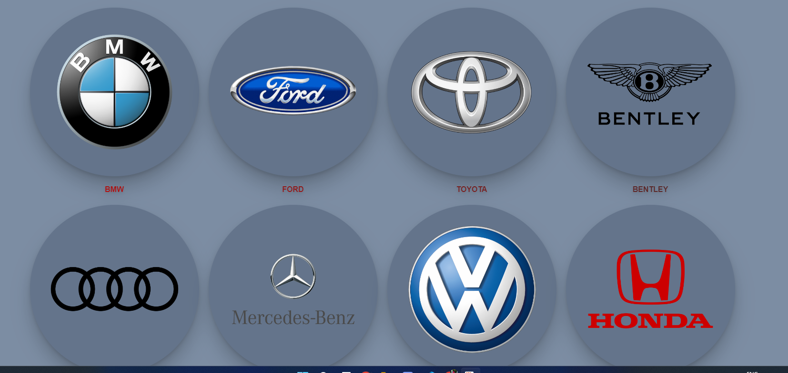
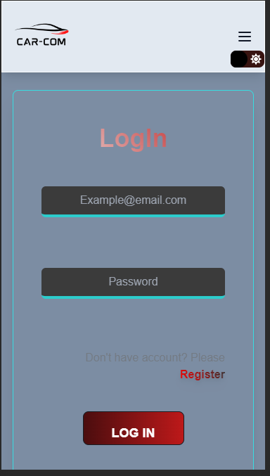
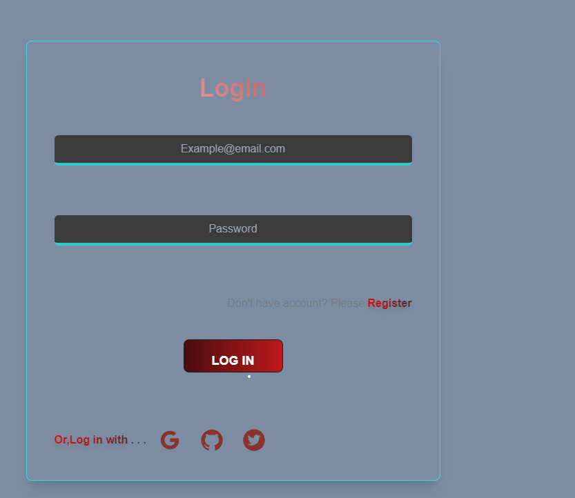

# Car-Com

<a href="https://car-com.web.app/" target="_blank" style="color:red;">Client site LIVE LINK:Click Here</a>
<a href="https://car-com-backend-hlo2j6lud-jhriyazs-projects.vercel.app/" target="_blank" style="color:red;">Backend LINK:Click Here</a>

<h1 style="text-align:center;">Features</h1>
<ul style="list-style:upper-roman">
    <li>
        

Dark mode

    </li>
    <li>
       

Search by brand

    </li>
    <li>
        

Responsive and mobile friendly design

    </li>
    <li>
        

user authentication system

    </li>
    <li>
        

Protected Routes

    </li>
    <li>
        

Sign In with google ,github or twitter

    </li>
    <li>
        

both html and js validation

    </li>
</ul>

